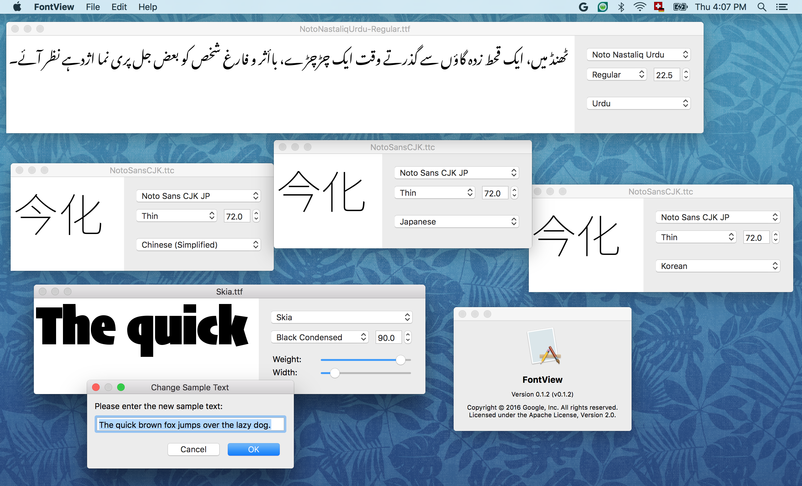

# FontView [](https://travis-ci.org/googlefonts/fontview)

“FontView” is a little demo app that shows the contents of a font
file. It opens `*.ttf`, `*.otf`, `*.ttc`, `*.otc`, `*.pfa`, and `*.pfb`
files. To render text, FontView uses the open-source libraries
[FreeType](https://www.freetype.org/),
[HarfBuzz](https://www.freedesktop.org/wiki/Software/HarfBuzz/), and
[Raqm](http://host-oman.github.io/libraqm/). FontView is not an
official Google product; use it at your own risk.



You’re very welcome to [contribute changes](CONTRIBUTING.md), for
example if you’d like porting the tool to other platforms than
macOS. (Because the program only calls cross-platform libraries,
porting should actually be quite easy). Likewise, please don’t
hesitate to add new features; simply send a GitHub pull request when
your change is ready.

## Building on macOS

```sh
$ git clone --recursive https://github.com/googlei18n/fontview.git;
# if you forget the recursive arg, run
# git submodule update --init --recursive
$ cd fontview
$ python2.7 build.py && ./build/FontView.app/Contents/MacOS/fontview
```

## Building on Linux

You need to first install wxWidgets as well as latest versions of FreeType,
HarfBuzz and FriBiDi.

```sh
$ git clone https://github.com/googlei18n/fontview.git
$ cd fontview
$ git submodule init
$ git submodule update src/third_party/raqm/libraqm
$ python build.py && ./build/fontview
```
