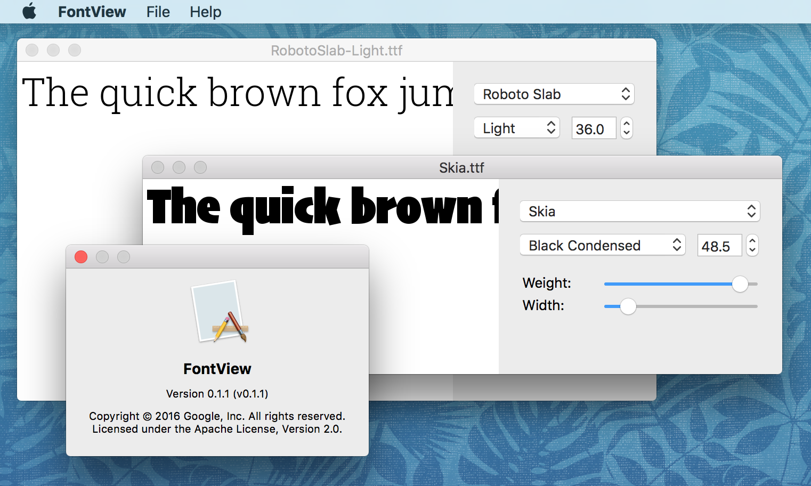

# FontView

“FontView” is a little demo app that shows the contents of a font
file. It opens `*.ttf`, `*.otf`, `*.ttc`, `*.otf`, and `*.pfb`
files. To render text, FontView uses the open-source libraries
[FreeType](https://www.freetype.org/),
[HarfBuzz](https://www.freedesktop.org/wiki/Software/HarfBuzz/), and
[Raqm](http://host-oman.github.io/libraqm/). FontView is not an
official Google product; use it at your own risk.



You’re very welcome to [contribute changes](CONTRIBUTING.md),
for example if you’d like porting the tool to other platforms.


## Building

```sh
$ git clone --recursive https://github.com/googlei18n/fontview.git
$ cd fontview
$ python build.py && ./build/FontView.app/Contents/MacOS/fontview
```
